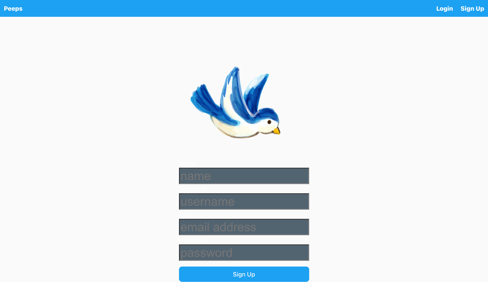
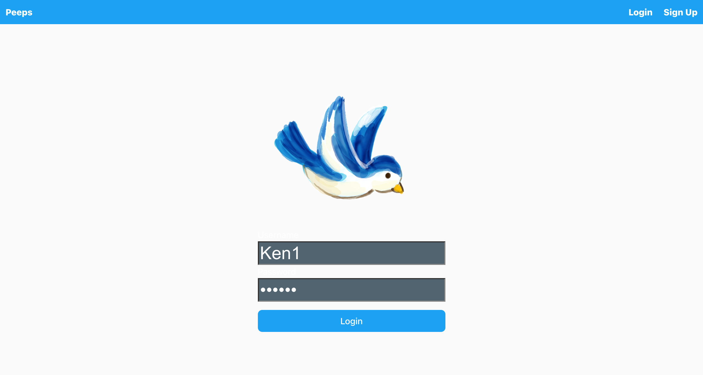
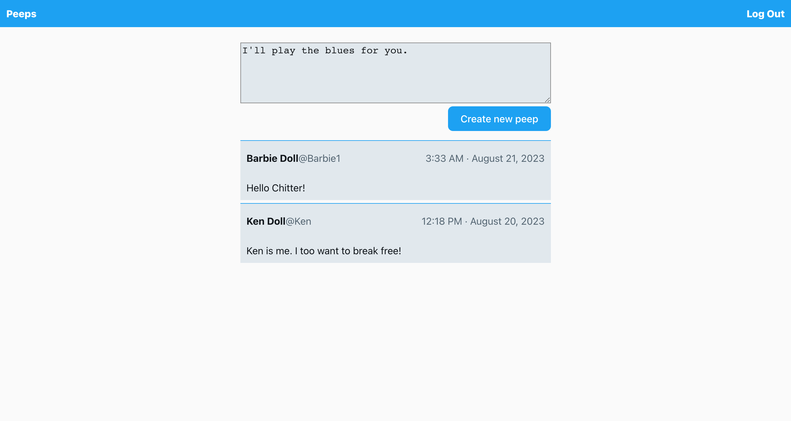
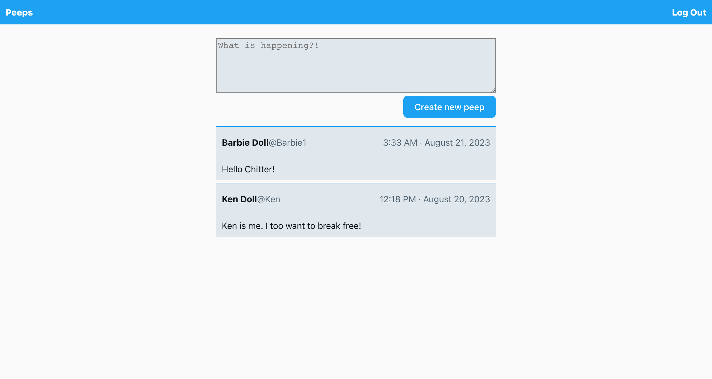

Chitter is a social networking app, which allows registered, signed in users to post messages ('peeps'). Peeps can be viewed by anyone. 

This is a social networking app. As a user, you can create new peeps, view everyone's peeps, as well as sign up, sign in and logout. Only logged in users can create new peeps. When not logged in, the Sign Up, Login and Peeps  buttons are visible. While logged in, only the Peep and Sign Out buttons are visible to the user.

#### Links

- See the [site](https://chitter-frontend.onrender.com/) (it's hosted on Render, so if it's not been hit recently it might take a minute to start)  
- See the [code](https://github.com/OanaDemian/chitter-MERN)

## Features

A user can:

- Sign up

- Sign in

- Create a new peep

- Sign out
- View a list of peeps

- ## Architecture

This application is comprised of two distinct pieces.

- A backend API built with Express
- A front end built with React

The React front end sends HTTP requests to the backend API and receives JSON in the response body, rather than a whole page of HTML.

## Authentication

Here's the authentication flow for this application:

1. A registered user submits their email address and username via the React front end.
2. The Express backend receives the data and tries to find a user in the DB with the same email address and username.
3. If a user is found, the password in the database is compared to the password that was submitted.
4. If the passwords match, a JSON Web Token is generated and returned, as part of the response.
5. The React front end receives the token and holds on to it.
6. Every request to `"/newPeep"` must include a valid token (which is checked by the backend).
7. When the user logs out, the front end discards the token.